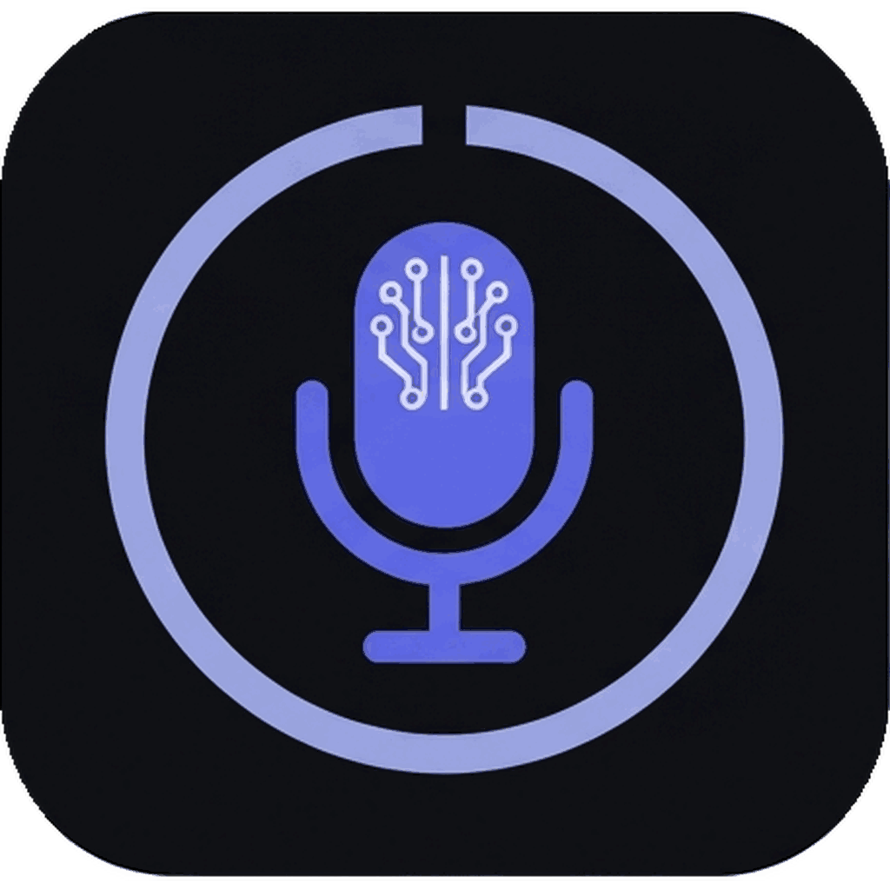

<p align="center">
  
</p>

<h1 align="center">PIE — Personal Intent Engine</h1>

<p align="center">
  <strong>Transform spoken thought into structured, production-ready prompts delivered directly to your active text field.</strong>
</p>

<p align="center">
  <a href="LICENSE"></a>
  
  
  
  
  
</p>

---

## Overview

Most voice-to-text tools dump raw, rambling transcripts into your focused application. **PIE** acts as intelligent middleware between your voice and AI models. Press a global shortcut anywhere, speak naturally, and PIE transcribes your speech **100% locally** (Metal-accelerated `whisper.cpp`), extracts your core intent, crafts a structured prompt, and pastes it into your focused text area — or routes it to your preferred LLM.

Your audio never leaves your machine.

---

## How It Works

```
 ┌────────────────┐      ┌────────────────┐      ┌────────────────┐      ┌────────────────┐
 │ Spoken Thought │ ───► │   Local STT    │ ───► │ Intent Engine  │ ───► │ Prompt Output  │
 └────────────────┘      └────────────────┘      └────────────────┘      └────────────────┘
   "Can you set up         whisper.cpp +           Extracts:               Pasted at cursor
    Docker & Postgres      Silero VAD (Metal       • Objective             or routed to
    without an ORM?"       accelerated)            • Constraints           OpenAI / LLM API
                                                   • Topics & Mode
```

---

## Key Features

- 🎙️ **Universal Global Hotkey** — Trigger recording (`⌘⇧Space`) from any application; results paste directly at your cursor.
- 🔒 **100% On-Device Transcription** — High-speed, private speech-to-text powered by `whisper.cpp` with Apple Silicon Metal acceleration and Silero VAD.
- 🧠 **Intent Extraction & Optimization** — Automatically strips filler and converts conversational speech into structured prompts (`compact`, `balanced`, `enhanced`, `adaptive`).
- ⚡ **Direct AI Integration** — Optionally route prompts directly to OpenAI or any OpenAI-compatible API endpoint.
- 🖥️ **Lightweight Tray App** — Runs silently in the menu bar with a customizable floating overlay.
- 📦 **In-App Model Management** — Download and manage Whisper and Silero VAD models directly within the app.
- 🛠️ **Developer Friendly** — Available as a desktop application, a standalone CLI tool, or a reusable Rust crate.

---

## Quick Install

Builds are **ad-hoc signed** (no Apple Developer ID), so macOS Gatekeeper would normally block them. The commands below strip the quarantine attribute (`xattr -cr`) so PIE opens cleanly.

### macOS (Apple Silicon)

```bash
# One-line install: downloads the latest release, installs to /Applications, clears quarantine
curl -fsSL https://raw.githubusercontent.com/abhishek-data/personal-intent-engine/main/scripts/install.sh | bash
```

To review the script before running it, download it first with `-o install.sh`, read it, then `bash install.sh`.

Alternatively, via **Homebrew**:
```bash
brew tap abhishek-data/pie https://github.com/abhishek-data/homebrew-pie
brew install --cask abhishek-data/pie/pie
xattr -cr /Applications/PIE.app
```

> **Manual Install**: Download `PIE_<version>_aarch64.dmg` from [Releases](https://github.com/abhishek-data/personal-intent-engine/releases), move to `/Applications`, then run `xattr -cr /Applications/PIE.app` (or right-click → **Open** the first time).

### Windows

Download the latest `.exe` installer from [Releases](https://github.com/abhishek-data/personal-intent-engine/releases). SmartScreen may warn about an unrecognized app — click **More info → Run anyway**.

---

## Quick Start (Building from Source)

### Prerequisites

- **Rust** (stable) & **Node.js** (v18+)
- **CMake** (required for `whisper.cpp` compilation: `brew install cmake`)

> Developed and tested on **macOS 11+ (Apple Silicon)** with Metal acceleration. Windows and Linux code paths exist but are currently untested.

### Development Setup

```bash
# 1. Clone the repository
git clone https://github.com/abhishek-data/personal-intent-engine.git
cd personal-intent-engine

# 2. Install Tauri CLI
cargo install tauri-cli --version "^2" --locked

# 3. Launch application in dev mode
cargo tauri dev
```

### Initial Run Setup

1. Open the **Models** tab in PIE to download a Whisper model (*Whisper Tiny* recommended) and *Silero VAD*.
2. Grant **Microphone** and **Accessibility** permissions when prompted by macOS.
3. Use the global shortcut `⌘⇧Space` to begin recording anywhere.

---

## CLI & Rust Library

### CLI Usage

```bash
# Process raw text into a structured prompt
cargo run -- --mode balanced --provider echo "help me set up docker with postgres for rust, no ORM"

# Send directly to an OpenAI model
OPENAI_API_KEY=sk-... cargo run -- --provider openai --model gpt-4o-mini "what is a lifetime in Rust?"

# Transcribe and process a WAV audio file
cargo run --features whisper -- \
  --audio-file input.wav \
  --whisper-model ~/.cache/pie/models/ggml-tiny.en.bin \
  --provider echo
```

Key flags: `--mode {compact|balanced|enhanced|adaptive}`, `--provider {echo|openai|openrouter}`, `--model`, `--language`, `--audio-file`, `--verbose`.

### Rust Library Usage

Add `pie-engine` to your `Cargo.toml`:

```rust
use pie_engine::PieEngine;

#[tokio::main]
async fn main() -> anyhow::Result<()> {
    let mut engine = PieEngine::new().await?;
    let result = engine.process("build a rest api in rust with postgres", "balanced").await?;

    println!("Optimized Prompt:\n{}", result.optimized_prompt);
    Ok(())
}
```

---

## Project Architecture

```
personal-intent-engine/
├── src/            # Core Rust library (pie-engine) & CLI (pie-cli)
│   ├── audio/      # Audio capture, resampling, Silero VAD
│   ├── stt/        # whisper.cpp STT integration
│   ├── intent/     # Intent extraction & classification logic
│   ├── optimizer/  # Prompt rewriting engines
│   └── llm/        # OpenAI-compatible API router
├── src-tauri/      # Tauri 2 Desktop container (pie-desktop)
└── ui/             # Svelte 5 frontend (Control Panel & Recording Overlay)
```

---

## Configuration

Settings live at `~/Library/Application Support/pie/settings.json` and are managed from the app's Settings panes:

| Setting | Description |
|---|---|
| Whisper / Silero model | Paths to the local models (set by the Models tab). |
| Language | Spoken-language ISO code, or `auto` to detect. |
| Optimization mode | How speech becomes a prompt (`compact` / `balanced` / `enhanced` / `adaptive`). |
| Provider / model | LLM target for "Send to LLM". `echo` reflects the prompt back for testing; `openai`/`openrouter` need `OPENAI_API_KEY`. |
| Hotkey | Global shortcut, rebindable by pressing a combo. |
| Paste output | Whether the hotkey pastes the raw transcript or the optimized prompt. |

---

## Privacy & Security

PIE operates under a **strict local-first paradigm**:
- Audio streams and transcriptions remain **100% local on your machine**.
- Outbound network requests occur **only** if you configure an external LLM provider and explicitly request to route prompts to it.
- No analytics or telemetry tracking.

---

## Acknowledgements

The audio-capture and desktop architecture adapted patterns from two MIT-licensed projects, whose attribution is retained here: **Handy** (audio worker, VAD state machine, model management) and **OpenSuperWhisper** (recording indicator, clipboard paste flow).

---

## License

Distributed under the [Apache 2.0 License](LICENSE).
